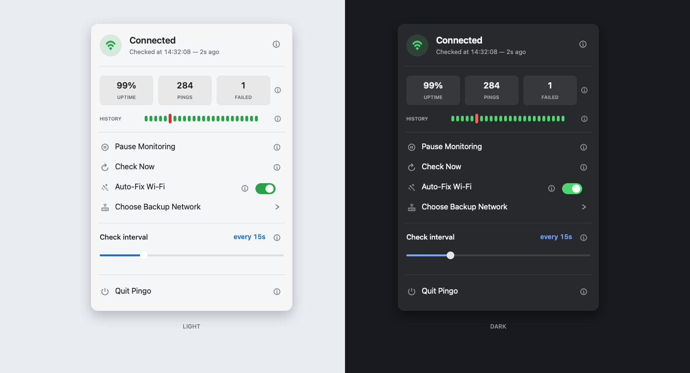

<!-- markdownlint-disable MD023 MD033 MD041 -->
<div align="center">
  

  # Pingo

  **A tiny network monitor for your Mac menu bar.**

  Know when your connection drops, when it returns, and how it has behaved at a glance.

  [](https://github.com/jonasdkhansen/pingo/releases/latest)
  [](main.swift)
  [](https://github.com/jonasdkhansen/pingo/releases/latest)

  [**Download Pingo for macOS**](https://github.com/jonasdkhansen/pingo/releases/latest)
</div>

---



<div align="center">
  <sub>Connection status, recent checks, Wi-Fi recovery, and manual update checks — all one click away.</sub>
</div>

Pingo lives quietly in the menu bar with no Dock icon and no main window. It checks two independent public DNS endpoints and changes state only when both stop responding, helping avoid false alarms caused by a single provider.

## At a glance

| | |
| --- | --- |
| **Instant status** | A green or red menu bar indicator shows whether the internet is responding. |
| **Native alerts** | Get notified when the connection drops and when it returns, including the outage duration. |
| **Live history** | See session uptime, total checks, failures, and recent connection results. |
| **Auto-Fix Wi-Fi** | Reconnect the active network without turning the Wi-Fi radio off. |
| **Backup network** | Switch once to a selected Wi-Fi network after three consecutive failed checks. |
| **Update checks** | Check GitHub Releases for a newer version only when you request it. |
| **Flexible checks** | Choose any interval from 1 to 60 seconds or run an immediate check. |
| **Built for macOS** | A lightweight Swift and AppKit app with native controls, SF Symbols, and no runtime dependencies. |

## How it works

Pingo sends one packet to both `1.1.1.1` (Cloudflare) and `8.8.8.8` (Google) with a three-second timeout. If either endpoint replies, the connection is considered online.

When the connection changes state, Pingo responds immediately:

- **Connection lost:** the antenna turns red and a notification appears.
- **Connection restored:** the indicator returns to green and the notification includes how long the outage lasted.
- **Monitoring paused:** checks stop completely and the menu bar icon dims.

Open Pingo from the menu bar to see the current status, recent history, session statistics, check interval, and quick controls. Settings persist across launches.

## Auto-Fix Wi-Fi

Auto-Fix is optional and disabled by default. When enabled, Pingo identifies the active access point, disconnects from it, and explicitly rejoins that same access point. The Wi-Fi radio stays powered on throughout the process.

Pingo verifies the access point's BSSID and advertised security capabilities before disconnecting. It refuses same-name access points with a different identity or security configuration. Auto-Fix can rejoin the open network already in use, but open networks remain ineligible as backup networks. A one-minute cooldown prevents repeated reconnect attempts during a wider outage.

> [!NOTE]
> macOS requires Location access to reveal Wi-Fi network names. Pingo requests this permission when Auto-Fix is enabled or when you open the backup network selector.

## Backup network

Open **Choose Backup Network** in Pingo's menu and select a nearby Wi-Fi network. Selecting one enables failover; use **Disable Backup** in the same submenu to turn it off.

When three consecutive internet checks fail on the current network, Pingo tries the selected backup once and verifies internet access after joining it. If Auto-Fix is enabled, Pingo first reconnects the current network after the initial failed check. Pingo does not alternate repeatedly between networks during an outage or automatically switch back to the primary network.

The backup must be protected and have a password already saved in the macOS Keychain. Pingo pins the selected access point's BSSID and security capabilities, then refuses automatic failover to same-name networks that do not match. Open networks are not eligible for automatic connection because their identity cannot be authenticated. When you select a backup, macOS may request an administrator password so Pingo can read its Wi-Fi password. Pingo keeps that password in memory for later failover and discards it when Pingo quits.

> [!IMPORTANT]
> BSSID pinning reduces evil-twin and Wi-Fi Pineapple risk, but Wi-Fi identifiers can be spoofed. Protected Wi-Fi still depends on the secrecy of its password, and Pingo cannot make an untrusted network safe. At hostile venues, prefer a personal hotspot or VPN and disable macOS auto-join for unfamiliar networks.

## Install

1. Download the latest macOS archive from [GitHub Releases](https://github.com/jonasdkhansen/pingo/releases/latest).
2. Extract the archive and move `Pingo.app` to your Applications folder.
3. Open Pingo. Its antenna indicator will appear in the menu bar.

Pingo is ad-hoc signed and is not Apple-notarized. On first launch, macOS may show **“Pingo” Not Opened** with only **Done** and **Move to Bin**. Moving the app to Applications does not remove this warning. Open Terminal and run:

```sh
xattr -dr com.apple.quarantine /Applications/Pingo.app
open /Applications/Pingo.app
```

This removes the quarantine flag from the downloaded app and launches it. Only run this command after downloading Pingo from this repository's official GitHub release.

### Update

Choose **Check for Updates…** in Pingo's menu. If a newer version is available, Pingo opens its GitHub release so you can download it. Quit Pingo, extract the archive, and replace the existing app in your Applications folder. Your saved settings are kept when the app is replaced.

### Start at login

Open **System Settings > General > Login Items**, select **+**, and add `Pingo.app`.

### Notifications

Notifications use macOS's script notification channel and appear as **Script Editor** under **System Settings > Notifications**. Allow notifications there if Pingo alerts are not visible.

## Privacy

Pingo has no analytics, telemetry, accounts, or network service of its own. It sends ICMP echo requests only to the configured connectivity-check hosts. When you choose **Check for Updates…**, Pingo makes a single request to the GitHub Releases API; it does not check in the background. Connection history and session statistics remain in memory and disappear when the app quits; only preferences such as the check interval and enabled state are stored in `UserDefaults`.

For Auto-Fix and backup failover, Pingo asks macOS for visible Wi-Fi network names and access-point identifiers, and retrieves saved passwords through the system Keychain API when selecting or connecting to a protected network. The selected backup network's SSID, BSSID, and security fingerprint are stored in `UserDefaults`; passwords are kept only in memory and are never persisted, logged, or transmitted by Pingo.

## Build from source

You need macOS 11 or newer and Xcode Command Line Tools:

```sh
xcode-select --install
git clone https://github.com/jonasdkhansen/pingo.git
cd pingo
./build.sh
open Pingo.app
```

The build script renders the app icon, compiles the Swift source, assembles the app bundle, and applies an ad-hoc signature.
Quit Pingo before rebuilding it; replacing the bundle while it is running prevents macOS from authorizing Keychain access.

For a distributable build, install an Apple Developer certificate and pass its identity so Keychain authorization remains stable across launches:

```sh
SIGNING_IDENTITY="Developer ID Application: Your Name (TEAMID)" ./build.sh
```

## Customize

Pingo intentionally keeps its implementation small. The complete app lives in [main.swift](main.swift).

- Edit `pingHosts` to change the endpoints. Pingo reports an outage only when every configured host fails.
- Edit `setIcon(state:)` to use different SF Symbols in the menu bar.
- Run `./build.sh && open Pingo.app` after making changes.

## Project layout

| Path | Purpose |
| --- | --- |
| `main.swift` | Complete Swift and AppKit application |
| `Info.plist` | Bundle metadata, version, permissions, and menu bar app configuration |
| `build.sh` | Icon rendering, compilation, app assembly, and signing |
| `assets/pingo.png` | Original Pingo artwork |
| `assets/pingo-app-icon.png` | Rendered macOS app icon master |
| `assets/render-app-icon.swift` | Icon renderer |
| `assets/pingo-readme-preview.png` | Light and dark README product preview |
| `assets/render-readme-preview.swift` | README product preview renderer |
| `assets/Pingo.icns` | macOS icon bundle |

## Test an outage

Turn Wi-Fi off for about 20 seconds. Pingo should report that the internet is down, then show a recovery notification after Wi-Fi is restored.

## License

Pingo is available under the [Apache License 2.0](LICENSE).

---

<div align="center">
  <sub>Small, native, and focused on one job.</sub>
</div>
