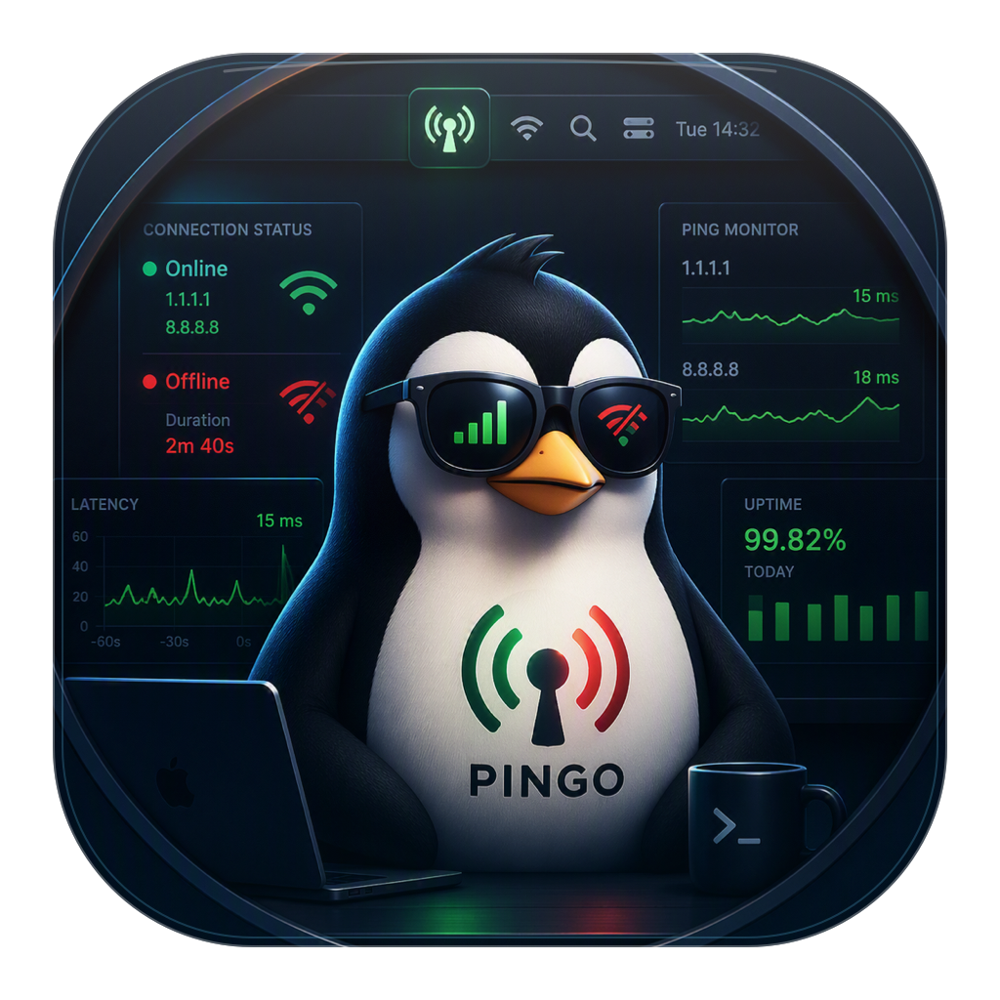

# Pingo 🐧

<p align="center">
  
</p>

**Pingo** is a tiny macOS menu bar app that watches your internet connection and tells you the moment it drops — and when it comes back.

Built for unstable wifi: instead of wondering why a page won't load, you get a notification and a red icon in the menu bar.

## How it works

- Pings `1.1.1.1` (Cloudflare) and `8.8.8.8` (Google) at a configurable interval (default **15 seconds**) with a single packet and a 3-second timeout. You're counted as online if **either** replies, so one provider's blip won't trigger a false "down" alert.
- **Connection lost:** the menu bar antenna icon turns red with a slash, and a notification (with sound) appears.
- **Connection restored:** another notification tells you how long the outage lasted (e.g. "Back after 2m 40s").

Clicking the menu bar icon opens a small dashboard:

- A **status header** — a colored badge and verdict ("Connected" / "No Internet"), with the last check time or how long the connection has been down.
- **Stat tiles** — uptime percentage, total pings, and failure count for this session.
- A **history bar** — the most recent checks as green/red bars (newest on the right), so a flaky connection is visible at a glance.
- **Pause/Resume Monitoring** — stops pinging entirely; the icon dims to show monitoring is off.
- **Check Now** — runs an immediate one-off check (works even while paused).
- **Auto-Fix Wi-Fi** — off by default. When enabled, if the internet stops answering Pingo turns Wi-Fi off and back on automatically (the classic fix for a connection that looks connected but has silently died), then re-checks a few seconds later. To avoid fighting a real outage, it won't cycle Wi-Fi more than once per minute.
- A **check interval** slider (1–60 seconds) to control how often Pingo pings. The interval and pause state are remembered across restarts.

Every section has a small **?** button — click it for a popup explaining what that feature does.

Pingo is menu-bar-only — no Dock icon, no window.

## Building

Requires Xcode Command Line Tools (`xcode-select --install`).

```sh
./build.sh
```

This generates the mascot app icon, compiles `main.swift`, and ad-hoc signs `Pingo.app` in the project folder.

## Running

```sh
open Pingo.app
```

### Start at login

System Settings → General → Login Items → "+" → select `Pingo.app` from this folder.

### Notifications

Notifications are delivered through macOS's script notification channel, which appears as **Script Editor** in System Settings → Notifications. If you don't see popups, make sure notifications are allowed there (choose "Alerts" if you want them to stay on screen until dismissed).

## Configuration

The check interval and pause state are set from the menu itself and persisted (via `UserDefaults`).

For anything else, the code lives in [main.swift](main.swift): `pingHosts` at the top changes the ping targets (add or remove hosts — down is only reported when they all fail), and the menu bar icons are SF Symbols set in `setIcon(state:)` — swap in any other symbol names if you want a different look.

After changing anything, rebuild and relaunch:

```sh
./build.sh && open Pingo.app
```

## Files

| File | Purpose |
|------|---------|
| `main.swift` | The entire app (Swift + AppKit) |
| `Info.plist` | App metadata; `LSUIElement` hides the Dock icon |
| `build.sh` | Generates the app icon, compiles, and ad-hoc signs `Pingo.app` |
| `assets/pingo.png` | Original Pingo mascot artwork |
| `assets/pingo-app-icon.png` | Generated modern macOS icon master |
| `assets/render-app-icon.swift` | Applies the squircle and glass treatment |
| `assets/Pingo.icns` | Generated macOS app icon |

## Testing it

Turn wifi off for ~20 seconds: you should get the "Internet is down" alert, then "Internet is back" once you re-enable it.
